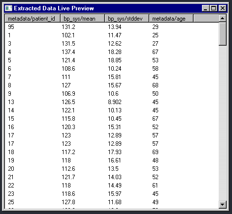
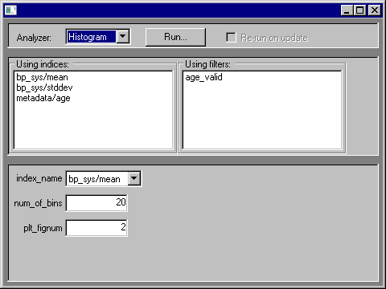

# BPV Analysis

This program is a utility for analyzing blood pressure variability
data. It is designed to be easily extensible with various analysis
methods.

# How to run

Ensure all dependencies are installed:

```commandline
python -m pip install -r src/requirements.txt
```

Run `src/main.py` afetr making sure this project's root
directory is in your PYTHONPATH:

```bash
# Linux
export PYTHONPATH=$(pwd)
python ./src/main.py
```

```
REM Windows cmd.exe

set PYTHONPATH=%cd%
python src/main.py
```

For Windows users, the app may be run with `bpvapp.bat`
in the root directory.

## Development
If using PyCharm, the run config `main` is provided
that should work out of the box.

# Architecture overview

(TODO better naming)

The data pipeline of the application may be roughly defined as:

```
BPV monitoring sessions --> [Filters] --> [Extractors] --> [Indices] --> [Dataframe] --> [Analyzers] --> Output
```


## Filters

A filter is a predicate on a BPV monitoring session (from this point on, we'll
call them sessions).

The user selects a set of filters, all of which are applied consecutively
to the entire list of sessions. This means that sessions must satisfy
all active filters in conjunction to qualify for further processing.

## Extractors

An extractor is a function on a session, annotated with a tag signifying
the type of the extractor's output.

For example, the 'bp_sys' returns an array of systolic BP readings for a given
session.

Extractors always return a tuple, possibly a single-element one.
This is so that the output may be expanded into multiple parameters
for an index calculation function.

## Indices

An index is a function on an extractor's output, mainly used to calculate
its statistical properties.

An index may specify which extractors it applies to. For example, the
`mean` and `stddev` indices apply to `tag:num_series`, which describes
any extractor that returns a 1D array of numbers as the first tuple element.

## Index paths

Since an index may apply to the output of many different extractors,
an extractor+index combination yields a single statistical property
for a given patient.

Such a combination is denoted by an "index path", which is of the following form:

`{extractor_name}/{index_name}`

For example, applying `bp_sys/mean` on a session will yield the mean
systolic blood pressure for that session.

In the app's GUI, the user may select any subset of all possible
extractor+index combinations.

## Dataframe

The "active dataframe", previewable in the GUI's `Data Preview` window,
has column for every active index path and a row for every patient in
the database:



Analyzers operate mainly on the active dataframe.

## Analyzers

Analyzers are configurable entities that perform calculations
on the active dataframe and can present the results to the user
in various forms:



The application is designed to make it easy to define your own analyzers.

An analyzer defines:
 - a form that describes its configuration options
 - a "process" operation that performs appropriate calculations
 - a "present" operation that presents the results to the user graphically
 - (TODO) a "present_as_markdown" operation that converts results to a Markdown report

# Adding your own analyzer

Create a file for an analyzer class in `src/analyzers`:

```python
# src/analyzers/customanalyzer.py
import src.bpvappcontext as appctx
import src.gui.forminputs as forminputs
from src.analyzers.abstractanalyzer import AbstractAnalyzer


class CustomAnalyzer(AbstractAnalyzer):
    def __init__(self, ctx: appctx.BPVAppContext, config: dict):
        self.app_context = ctx
        self.config = config
```

Define configuration for the analyzer inside the class:

```python

@staticmethod
def create_config_form(ctx: appctx.BPVAppContext):
    return [
        forminputs.Boolean(
            key="option1",
            initial_value=True
        ),
        forminputs.OneOf(
            key="mode",
            choices=["regular_mode", "irregular_mode"]
        )
    ]
```

Define `process` and `present` methods, with the following signatures:

```python
def process(self, active_dataframe: pandas.DataFrame):
    # your code
```

```python
def present(self):
    # your code
```

Refer to `src/analyzers/*.py` for further reference on how to create analyzers.

Add the analyzer to `src/analyzers/__init__.py` so that it is visible to
importers of `src.analyzers`:

```python
from src.analyzers.customanalyzer import *
```

Finally, add the analyzer to the registry in `src/registry/analyzers.py`:

```python
AnalyzerDescription(
    name="custom",
    display_name="A custom analyzer",
    clazz=analyzers.CustomAnalyzer
)
```

The analyzer should now be available from the GUI.
